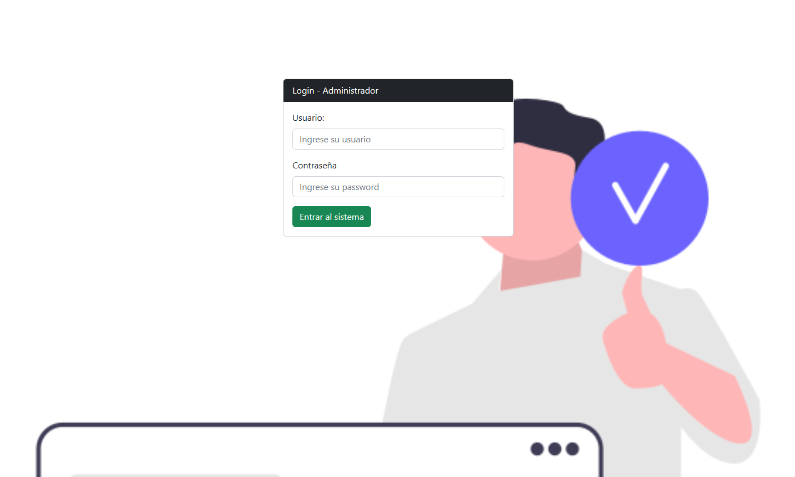
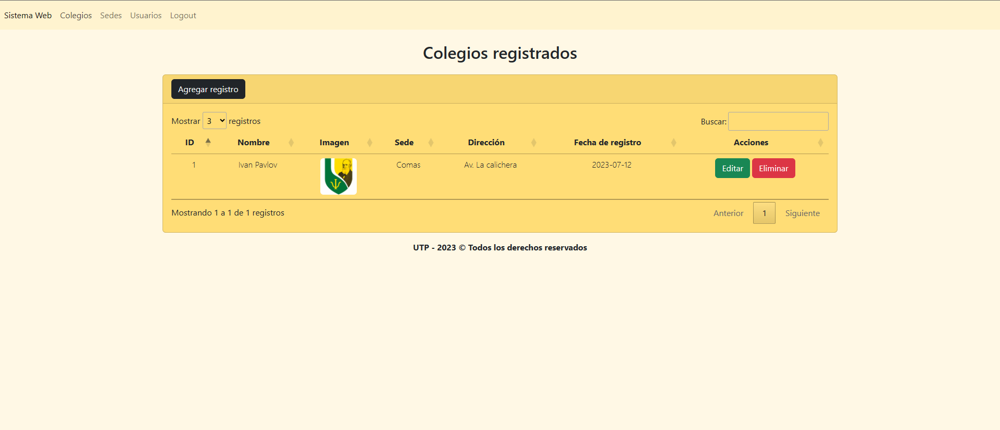
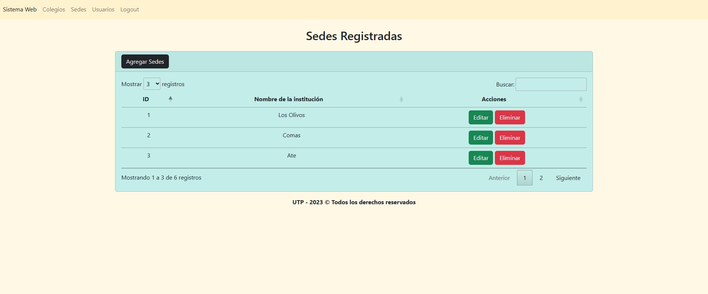
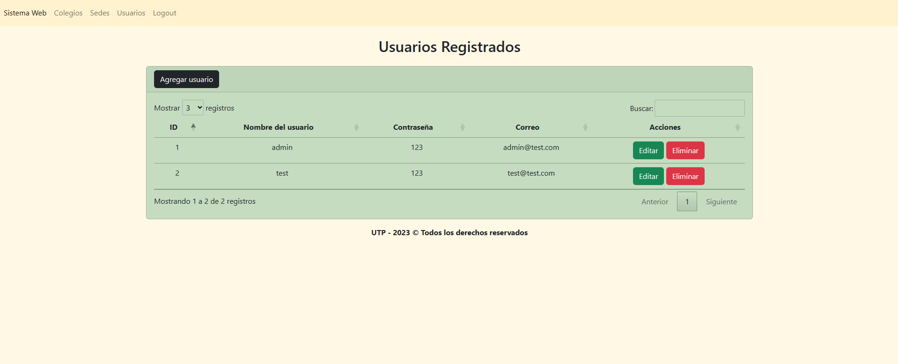

# Sistema-Web-Registro-de-colegios
Proyecto para el curso de Innovación y transformación digital - UTP
Es un sistema web para registro de colegios de la empresa ETERSAC. Asi mismo, aplicamos un ChatBot, motor de recomendaciones y machine learning.

### Integrantes:
- Angelo Alexandro Asencios Guerrero
- Bryan Jesus Jara Huacre
- Denilson Anthony Vivanco Carranza

## Capturas
### Home

### Login

### Colegios

### Sedes

### Usuarios

## Vista previa
 
